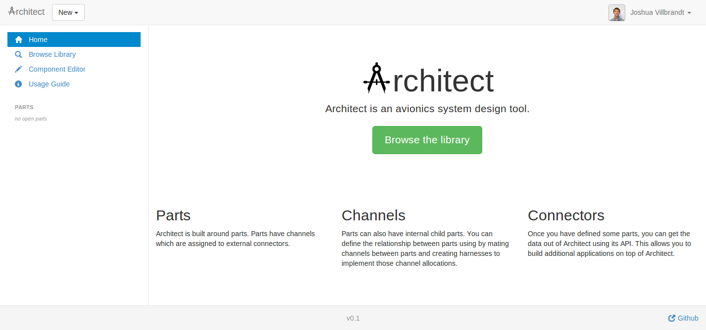

Architect
=========

Architect is a web-based avionics system design tool.

## Overview

This tool was designed out of the need for a simple yet powerful design tool for large electronic systems.

Architect is built around the idea of a part. Parts have channels (which inherit properties from channel types) and each channel has one or more signals. Connectors are the external interfaces for channels. Individual contacts on a connector are assigned to one (or more...) channel signal. Completing this information for one part produces a complete definition of all of the possible input and outputs of a part. This information is what is classically stored in an Interface Control Document or ICD.

## Setup

This setup sequence has been tested on Ubuntu 12.04. If you'd like, you can set up a virtual environment. Otherwise, skip those steps.

    sudo apt-get install python-pip
    #pip install virtualenv
    #virtualenv djangoenv
    #source djangoenv/bin/activate
    pip install Django==1.5

Next, clone the project and initialize the database. The database is automatically populated with an admin user called "user" with password "password".

    cd ~/
    git clone https://github.com/joshvillbrandt/Architect.git
    cd Architect
    python manage.py syncdb --noinput

If you would like, you can preload some data.

    python manage.py loaddata MyPart.json (TODO)

Finally, you can run the server.

    python manage.py runserver 0.0.0.0:8001

## Screenshot

## Implementation Guide

This section describes the rational and intended usage for different parts of Architect.

### Schema Mentality

Throughout the design of Architect's schema, there existed a constant philosophical battle between using less tables with more properties or more tables with less properties. The big gain from using less tables is that history tracking becomes much more straightforward. If you stick everything related to one object in one big table, you can track history by creating 

A conscience choice between using a document database or a relational database was made when implementing Architect. A document based database could have reduced the number of tables or collections by making use of embedded documents, however, document databases do not automatically create unique identifiers for embedded documents (at least not in MongoDB.) If this was the case, the schema could have been smaller and saving model history would have been easier. As a result, a relational database was ultimately chosen.

 (TODO)

less tables is easier to version control but it means duplication of data and more work to change all of the data types which is bad bad bad (TODO)

### Channel Schema

A lot of thought went into deciding how to implement channel types. Different implementations show the most different when considering how to provide suggested channel mates (see Automatic Mating Suggestions.) One possible way to implement channels would have been to explicitly store properties of different channel types and then to apply rules to suggest acceptable channel mates. (This would have been similar to the solution chosen for connectors. See Connector Scheme for more on that.) A flexible storage mechanism could have even been devised that allowed for channel types to opt-in to certain properties. However, the fear of automatically suggestion unintended and unanticipated channel mates drove us away from this idea. As a result, channel types are flat or property-less objects. Suggested channel mates are explicitly defined by the user when creating a new channel.

### Connector Schema

The connector schematic was designed to be very flexible and at the same time contain enough information to enable suggestions of compatible connectors (see the Automatic Mating Suggestions section below.) When deriving this schema, four different "connector" scenarios were considered:

* a lug with one or more ring terminals
* gendered connectors (circular or otherwise) with different possible insert arrangements
* genderless connectors which have exactly one insert arrangement (in other words, two identical connectors can plug into each other)

Terminal blocks like those made by Wago were also considered here. Since these can have complicated internal electrical connections, Wago blocks should be treated as parts instead of connectors.

### Automatic Mating Suggestions

One of the goals of Architect is to automatically connect channels between signals and also to automatically create harnesses between parts. Both of these automatic connections happen in the user interface and both of these should be treated as suggestions only. The database and user interface should both allow for these suggestions to be overridden. By providing these automated features, the manual labor required from the user is reduced which minimizes opportunities for error and minimizes the  time cost.

Suggested channel mates are explicitly defined - there are no implied acceptable channel mates based on the definition of a channel alone. Explicit channel mates are defined in the TODO table and stored against one ChannelType. A good convention is to store suggested channel mates only for "output" devices.

Suggested connector mates are implicitly defined based on rules. Specifically, all of the following conditions between two ConnectorTypes must be true in order to be compatible:

* must not currently be exceeding the maximum number of simultaneous connections (ConnectorType.max_connections) of any connector
* must have the same ConnectorSeries
* must have the same ConnectorSize
* must have the opposite ConnectorShell or the same ConnectorShellType if it is genderless
* must have the same ConnectorKey or all or all but one of the ConnectorKeys is universal
* must have the same ConnectorInsert with one connector having the "primary" pattern and the other having the "flipped" pattern unless the ConnectorInsert is "genderless" in which case is doesn't matter

### Depreciation

Many model types (most non-instance types) have a depreciated field. The intent here is that the UI sorts these items to the bottom of selection lists in an effort to discourage their use. The user should record the reason for depreciation in the change comment on submission.

## Todo
* schema for internal channels
* schema for harnesses
* schema for passthroughs
* tasty pie
* breeze.js
* exposing child channels externally